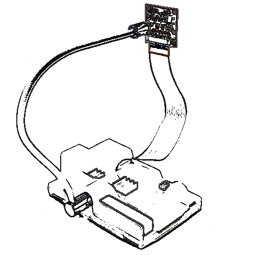
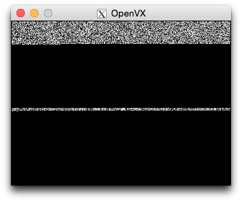
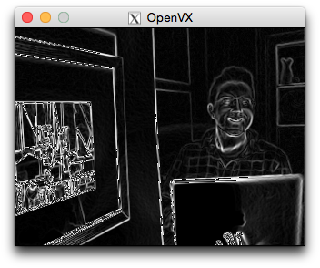

# OpenVX Running on a Raspberry Pi

**_N.B. 26th March 2017 -  This article was written almost 2 years ago about April 2015. Thinks have moved on a bit with OpenVX - but not too much. So hopefully this is still mostly relevant. I may update this at somepoint..._**

### Introduction

This post is (was) intended as a quick introduction to the possibility of using OpenVX on that most ubiquitous and appealing of embeddable/single-board computers: the Raspberry Pi. 

However, in the course of writing this all down, it seems to have grown in length to cover everything from accessing video on Linux, modifying the build instructions, to writing a custom OpenVX graph. Hopefully this won't put anyone off! 

The intention is still the same: to allow the Pi enthusiast a way to experience OpenVX as a means to writing a Computer Vision application.

For simplicity, we give instructions for compiling the OpenVX sample implementation directly on the Pi itself. This may be slower - but avoids any complexities with cross-compiling, and it will result in reasonably optimised executable. 

**However, a key realisation at the conclusion of all this is that the resulting performance lag is rather a hindrance for any serious real-time use. We discuss this further in the final section of this article, and have a few suggestions about what can be done.**

The article assumes a basic familiarity with the Raspberry Pi command line and general operation, and it will help to understand programming `C` a bit. Plus, we are basing this on the assumption the reader has purchased and connected an official Raspberry Pi camera module. Using an alternative camera is possible - but will require locating and using an appropriate Video for Linux kernel module. Furthermore, these instructions should also be roughly compatible with other Debian based Linux distribution - so could be followed to perform installation on other such systems.
	
### Updating the Pi & Enabling the Camera Module

This article was written while using a Raspberry Pi 1 Model B+ with a Pi NoIR camera module attached (as per the image at the head of the article- with the lovely case provided by a [Grasping Hand](http://www.graspinghand.com)). On to this was performed a clear install of the latest version of Raspbian (wheezy-3.18). 

If you want a small reminder on how to install your system onto the SD card look [here](https://www.raspberrypi.org/documentation/installation/installing-images/). Following a clean install you will also need to update and configure it, for which the commands are as follows:

	sudo rpi-update
	sudo reboot
	sudo raspi-config

The last command will launch you into the configuration utility. Assuming you have already configured this Pi before - e.g. enlarged the filesystem, selected a locale, etc. you might not have to do much. However, you might not have turned on the camera, in which case  go to `Option 5) "Enable Camera"` and enable it. Then choose "Finish" and "Yes" to reboot.

The documentation about installing [the camera module](https://www.raspberrypi.org/documentation/configuration/camera.md) and using the [control software](https://www.raspberrypi.org/documentation/raspbian/applications/camera.md) actually tends to omit the fact that there is another way to effectively "talk" to the camera via a [Video4Linux](http://en.wikipedia.org/wiki/Video4Linux) kernel module (now bundled in as part of the recent updates). Simply type:

	sudo modprobe bcm2835-v4l2

N.B. If you want this to happen every time you boot the system - add an entry to the `/etc/modules` file with:

	echo "bcm2835-v4l2" | sudo tee -a /etc/modules

Now if you do a `lsmod` after you should see this driver loaded alongside the supporting v4l modules. e.g. the top module listed here:

	$ lsmod
	Module                  Size  Used by
	bcm2835_v4l2           40308  0 
	videobuf2_vmalloc       3360  1 bcm2835_v4l2
	videobuf2_memops        2361  1 videobuf2_vmalloc
	videobuf2_core         41981  1 bcm2835_v4l2
	v4l2_common             8285  2 bcm2835_v4l2,videobuf2_core
	videodev              154352  3 bcm2835_v4l2,v4l2_common,videobuf2_core
	media                  16088  1 videodev
	...

What this module ultimately does is create a `/dev/video0` device on the filesystem, and (because this is Linux where [everything is a file](http://en.wikipedia.org/wiki/Everything_is_a_file)) you can now communicate directly with it.

Now, for example, if I am remotely accessing my Pi, I can log-in and allow the [X server software on my Mac](http://xquartz.macosforge.org/landing/) to display with `export DISPLAY=:0.0` and `ssh -X ip.addr.of.pi`. Then, having installed `mplayer` on the Pi (via `sudo apt-get install mplayer`) I can then type:

	mplayer tv:///dev/video0

This should open a remote window from your Pi, in which you should see some live video from the camera!

### Download OpenVX

At this point we have got the system up and running and checked we can access video from the camera. Now we are ready to download the [OpenVX 1.0 sample implementation](https://www.khronos.org/openvx/) onto the Pi (click on the link there for "Sample implementation (tgz)".

Alternatively, you can use these commands to download and unpack it directly... 

	wget https://www.khronos.org/registry/vx/sample/openvx_sample_20141217.tar.gz
	tar -zxvf openvx_sample_20141217.tar.gz
	cd openvx_sample/

### Define a Sobel Graph

The code for the implementation of OpenVX comes with an example tool called `vx_cam_test`. 

We want to add our own definition of a OpenVX graph to this code that will demonstrate the Sobel operator. (Note that you can accomplish this without really understanding how to program in `C` or the operation of OpenVX and just get it working by downloading and replacing the file with the changes already made [here](vx_cam_test.c).)

Having unpacked the sample implementation,`cd` into the directory `openvx_sample` and locate the file `./sample/tests/vx_cam_test.c`. Copy/define this new function in the file:

	vx_graph vxSobelGraph(vx_context context, 
			      vx_image input, 
			      vx_threshold thresh,
			      vx_image output)
	{
	  vx_int32 by = 0;
	  vx_scalar shift = vxCreateScalar(context,VX_TYPE_INT32,&by);
	  vx_graph graph = vxCreateGraph(context);
	  if (graph)
	  {
	    vx_uint32 n = 0;

	    vx_image virts[] = {
	      vxCreateVirtualImage(graph, 0, 0, VX_DF_IMAGE_U8),
	      vxCreateVirtualImage(graph, 0, 0, VX_DF_IMAGE_S16),
	      vxCreateVirtualImage(graph, 0, 0, VX_DF_IMAGE_S16),
	      vxCreateVirtualImage(graph, 0, 0, VX_DF_IMAGE_S16),
	      vxCreateVirtualImage(graph, 0, 0, VX_DF_IMAGE_U8),
	    };

	    vx_node nodes[] = {
	      vxChannelExtractNode(graph, input, VX_CHANNEL_Y, virts[0]),
	      vxSobel3x3Node(graph, virts[0], virts[1], virts[2]),
	      vxMagnitudeNode(graph, virts[1], virts[2], virts[3]),
	      vxConvertDepthNode(graph,virts[3],virts[4],VX_CONVERT_POLICY_WRAP,shift),
	      vxChannelCombineNode(graph, virts[4], virts[4], virts[4], 0, output),
	    };

	    vxAddParameterToGraphByIndex(graph, nodes[0], 0); //Input
	    vxAddParameterToGraphByIndex(graph, nodes[4], 4); //Output

	    for (n = 0; n < dimof(nodes); n++)
	      vxReleaseNode(&nodes[n]);
	    for (n = 0; n < dimof(virts); n++)
	      vxReleaseImage(&virts[n]);
	  }
	  return graph;
	}

This is one of the fundamental way to write an OpenVX application. Briefly: the concept is that we set-up a **graph** of connected **nodes** representing atomic operations performed on image data. These are connected internally by specifying virtual images of the correct type between nodes, and externally by adding parameters to allow the data of certain nodes to accessed. The great advantage of using graphs is that OpenVX can optimise and distribute the graph operations to available hardware "under the bonnet" so that the programmer doesn't have to. 

After adding this function - we need to "wire it up". Look around lines 466 to 469 in the same file and replace the graph we are defining with this new function.

	// input is the YUYV image.
	// output is the RGB image
	//graph = vxPseudoCannyGraph(context, images[0], thresh, images[dimof(captures)]);
	graph = vxSobelGraph(context, images[0], thresh, images[dimof(captures)]);

Then look from about lines 491 onwards and make sure the input and output image parameters on the graph are set correctly as follows:

	status = vxSetGraphParameterByIndex(graph, 0, (vx_reference)images[camIdx]);
	assert(status == VX_SUCCESS);
	status = vxSetGraphParameterByIndex(graph, 1, (vx_reference)images[dispIdx]);
	assert(status == VX_SUCCESS);

By default, the `vx_cam_test` tool only processes 10 frames before quiting. You can easily modify the code for more processing, or indeed larger frame size by changing the default values at the top of the main function. 

	int main(int argc, char *argv[])
	{
	    uint32_t width = 320, height = 240, count = 10;
	...

### Prepare to Build

Now we ready to build and install the OpenVX libraries along with the `vx_cam_test` tool to run our Sobel graph example.

Start by making sure your Pi's build commands and utilities are up-to-date.  The latest version of Raspbian has git-core, gcc, and build-essential packages already installed by default. 

	sudo apt-get update -y && sudo apt-get upgrade -y

This might take a while. When finished, install the `cmake` tool.

	sudo apt-get install cmake

And the SDL library, which is a dependency of our example. **Note that this is version 1.2 - not 2.**

	sudo apt-get install libsdl1.2-dev 

Also get the `checkinstall` tool, which is a great way to finally package our build (in case we want to remove or upgrade it later).

	sudo apt-get install checkinstall

Now, before we actually set the build running, there are three very quick minor changes to be made to the `cmake` instructions for it to work on the Raspberry Pi. 

First, edit line 27 of the top-level (i.e. in openvx_sample) `./CMakeLists.txt` to use version 2.8.9 of `cmake` instead of 2.8.12.

	cmake_minimum_required(VERSION 2.8.9)

Now, then change line 43 of `./cmake_utils/CMake_linux_tools.cmake` to remove the reference to `-m32 -march=core2`. Just leave it blank.

	set(ARCH_BIT "" )

Finally, the file `./sample/tests/CMakeLists.txt` needs to be updated to include the SDL library locations. Insert the following after the set `TARGET_NAME_CAM_TEST` on line 45... 

	set( TARGET_NAME_CAM_TEST vx_cam_test )

	include( FindSDL )
	include_directories( BEFORE ${SDL_INCLUDE_DIR} )

...and update line 53 to include the `${SDL_LIBRARY}`. 

	target_link_libraries( ${TARGET_NAME_CAM_TEST} 
		openvx-debug-lib openvx-extras-lib openvx-helper 
		openvx vxu ${SDL_LIBRARY} )

Phew. Now we are good to go!

### Build It 

Having done all the hard work above, we now can just type the following commands from the top-level directory (i.e. in `openvx_sample`). Notice how we perform what is called an "out of source" build by making a separate folder to keep it all in.

	mkdir build
	cd build
	cmake -DCMAKE_BUILD_TYPE=Release -DCMAKE_INSTALL_PREFIX=/usr/local -DOPENVX_USE_SDL=1 ..
	make

You should then see the code being compiled and linked - each line with a percentage telling you how much has been completed.

When it has finished, you can then type the following to use `checkinstall` to create an official package on the system.

	sudo checkinstall --pkgname openvx --pkgversion 1.0 

Just follow the instructions on screen -e.g. enter "OpenVX" for summary of the package. Using this mechanism, if you then ever want to remove the package - it's a simple:

	sudo apt-get remove --purge openvx 

### Run It

Following installation, the OpenVX libraries and the `vx_cam_test` command will be available. 

To run it, just type: 

	vx_cam_test

However, we are one (final!) step away from making sure this will work. Remember that our input image in the filter code is expected to be in the YUYV format. If the camera kernel module is not currently set to generate this, it will cause misalignment of the image data. 

The `w4l2-ctl` command can be used to fix this. Using it to list all available formats you should see an option similar to this:

	$ v4l2-ctl --list-formats
	...
	Index       : 1
	Type        : Video Capture
	Pixel Format: 'YUYV'
	Name        : 4:2:2, packed, YUYV
	...

We can change to this format (and set the expected resolution of the camera) by using the following command - where the last number is the index of the format we want to use (1 in this case):

	v4l2-ctl --set-fmt-video="width=320,height=240,pixelformat=1"

If you forget to do this when running the <code>vx_cam_test</code> tool - you'll know it instantly because the video playback will look like this:

Otherwise, you should see some actual output like this - displaying a live, Sobel graph processed view from the camera.

N.B. If you are trying to do this remotely and nothing displays - remember to `export DISPLAY=:0.0` and use `ssh -X` to allow your X server permission.)

### Acceleration

What you'll immediately notice about this even very simple graph is the lag! It isn't exactly fast - even downsampled to 320x240 pixels.

Sadly, at this early stage, the OpenVX sample implementation doesn't offer up any support for hardware acceleration on the Raspberry Pi. Nor should it - as it is only intended to provide an initial framework for OpenVX programming. Hardware support for specific embedded hardware - for example by Movidius and Nvidia - is only just starting to emerge, and will (of course) be deployed first on other consumer devices.  

However, that doesn't mean the Pi can't exploit it's own hardware to provide a faster implementation.

One trick to achieving this is to shift the processing to the GPU, by using OpenGL shaders to instead perform the calculations required. This has [already been proven](http://robotblogging.blogspot.co.uk/2013/10/gpu-accelerated-camera-processing-on.html) and indeed is widely exploited in other accelerated image processing libraries [on other platforms](https://github.com/BradLarson/GPUImage) (which are also recently available to the Pi).

Doing this, and so increasing the real-time processing capability of the Pi, and would open up a world of possibilities - imagine an [existing drone controller](http://www.emlid.com) combined with additional visual information, or other [drone/robotics platforms](https://www.kickstarter.com/projects/ziphius/ziphius-the-aquatic-drone) able to make sense of their world autonomously. Maybe even [spot your neighbours cat more effectively](http://norris.org.au/cattack/)spot your neighbours cat more effectively).

